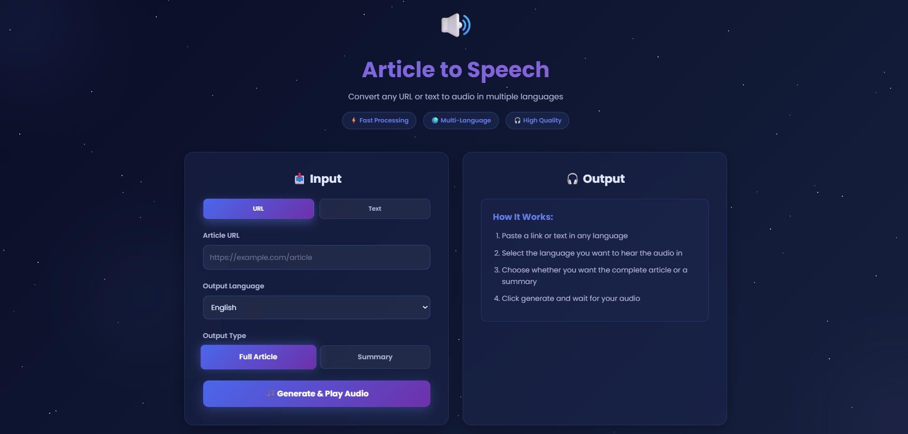

# 🔊 Article to Speech Converter

> Transform any article or text into high-quality audio in multiple languages with AI-powered translation and summarization

[](https://fastapi.tiangolo.com/)
[](https://www.python.org)
[](https://streamlit.io)
[](https://langchain.com)



## 📺 Demo Video

https://github.com/user-attachments/assets/your-video-id-here

> **Note:** To add your demo video to the README:
> 1. Go to any GitHub issue or pull request
> 2. Drag and drop your video file into the comment box
> 3. GitHub will upload it and generate a URL
> 4. Copy the generated URL and replace the placeholder above

**Alternative methods to embed video:**

```markdown
<!-- Method 1: Direct video embed (if video is in repo) -->
https://user-images.githubusercontent.com/yourusername/your-video.mp4

<!-- Method 2: YouTube embed (if uploaded to YouTube) -->
[](https://www.youtube.com/watch?v=VIDEO_ID)

<!-- Method 3: Using HTML for more control -->
<video src="demo_video.mp4" controls="controls" style="max-width: 730px;">
</video>
```

## ✨ Features

- 🌐 **Multi-language Support**: Convert articles to audio in English, Hindi, French, and Spanish
- 🤖 **AI-Powered Processing**: Uses LLM (Gemma 3:1b) for intelligent text cleaning and translation
- 📝 **Smart Summarization**: Generate concise summaries or full article audio
- 🎯 **Multiple Input Methods**: Support for both URLs and direct text input
- 🎧 **High-Quality Audio**: Crystal clear text-to-speech using Google's gTTS
- 🚀 **Fast Processing**: Optimized pipeline with multiple article extraction methods
- 💾 **Easy Download**: Download generated audio files in MP3 format
- 🎨 **Beautiful UI**: Modern, responsive interface with two frontend options (Streamlit & HTML)

## 🏗️ Architecture

```
┌─────────────────┐
│  User Interface │
│ (Streamlit/HTML)│
└────────┬────────┘
         │
         ▼
┌─────────────────┐
│   FastAPI API   │
│   (api.py)      │
└────────┬────────┘
         │
         ▼
┌─────────────────────────────────────┐
│         Backend Pipeline            │
│         (backend.py)                │
│                                     │
│  ┌──────────────────────────────┐  │
│  │  1. Article Extraction       │  │
│  │     • Newspaper3k            │  │
│  │     • Trafilatura            │  │
│  │     • Readability-lxml       │  │
│  └──────────────────────────────┘  │
│              │                      │
│              ▼                      │
│  ┌──────────────────────────────┐  │
│  │  2. LLM Processing           │  │
│  │     • Text Cleaning          │  │
│  │     • Translation            │  │
│  │     • Summarization          │  │
│  │     (Gemma 3:1b via Ollama) │  │
│  └──────────────────────────────┘  │
│              │                      │
│              ▼                      │
│  ┌──────────────────────────────┐  │
│  │  3. Text-to-Speech           │  │
│  │     • Google TTS (gTTS)      │  │
│  │     • MP3 Generation         │  │
│  └──────────────────────────────┘  │
└─────────────────────────────────────┘
```

## 🛠️ Tech Stack

### Backend
- **FastAPI**: High-performance web framework for building APIs
- **Python 3.8+**: Core programming language
- **LangChain + Ollama**: LLM orchestration framework
- **Gemma 3:1b**: Lightweight yet powerful LLM for text processing and translation

### Article Extraction
- **Newspaper3k**: Primary article extraction library
- **Trafilatura**: Fallback extraction with advanced web scraping
- **Readability-lxml**: Final fallback for complex websites
- **BeautifulSoup4**: HTML parsing and cleaning

### Text-to-Speech
- **gTTS (Google Text-to-Speech)**: High-quality TTS engine supporting multiple languages

### Frontend
- **Streamlit**: Python-based interactive web app (app.py)
- **HTML/CSS/JavaScript**: Custom responsive UI (frontend_index.html)

### Additional Tools
- **HTTPX**: Async HTTP client
- **Uvicorn**: ASGI server for FastAPI
- **python-dotenv**: Environment variable management

## 📋 Prerequisites

Before running this project, ensure you have:

1. **Python 3.8 or higher** installed
2. **Ollama** installed and running ([Download here](https://ollama.ai))
3. **Gemma 3:1b model** downloaded in Ollama

### Installing Ollama and Gemma

```bash
# Install Ollama (macOS/Linux)
curl -fsSL https://ollama.ai/install.sh | sh

# For Windows, download from https://ollama.ai/download

# Pull the Gemma 3:1b model
ollama pull gemma3:1b

# Verify installation
ollama list
```

## 🚀 Installation & Setup

### 1. Clone the Repository

```bash
git clone https://github.com/yourusername/article-to-speech.git
cd article-to-speech
```

### 2. Create Virtual Environment

```bash
# Create virtual environment
python -m venv venv

# Activate virtual environment
# On Windows:
venv\Scripts\activate
# On macOS/Linux:
source venv/bin/activate
```

### 3. Install Dependencies

```bash
pip install -r req.txt
```

### 4. Verify Ollama is Running

```bash
# Start Ollama service (if not already running)
ollama serve

# In another terminal, verify the model
ollama run gemma3:1b "Hello"
```

## 🎮 Running the Application

### Option 1: FastAPI Backend + Streamlit Frontend

**Terminal 1 - Start FastAPI Backend:**
```bash
python api.py
```
The API will be available at `http://localhost:8000`
- API Docs: `http://localhost:8000/docs`
- Health Check: `http://localhost:8000/health`

**Terminal 2 - Start Streamlit Frontend:**
```bash
streamlit run app.py
```
The Streamlit app will open in your browser at `http://localhost:8501`

### Option 2: FastAPI Backend + HTML Frontend

**Terminal 1 - Start FastAPI Backend:**
```bash
python api.py
```

**Terminal 2 - Serve HTML Frontend:**
```bash
# Using Python's built-in server
python -m http.server 3000
```
Open `http://localhost:3000/frontend_index.html` in your browser

## 📖 Usage

### Using the Web Interface

1. **Choose Input Method**:
   - **URL Tab**: Paste the article URL (e.g., `https://example.com/article`)
   - **Text Tab**: Paste article text directly

2. **Select Output Language**:
   - 🇬🇧 English
   - 🇮🇳 Hindi
   - 🇫🇷 French
   - 🇪🇸 Spanish

3. **Choose Output Type**:
   - **Full Article**: Complete article converted to audio
   - **Summary**: Concise 2-3 sentence summary as audio

4. **Generate Audio**:
   - Click "🎵 Generate & Play Audio"
   - Wait for processing (extraction → translation → audio generation)
   - Listen to the audio player
   - Download the MP3 file

### Using the API Directly

```bash
# Generate audio from URL
curl -X POST "http://localhost:8000/generate" \
  -H "Content-Type: application/json" \
  -d '{
    "url": "https://example.com/article",
    "language": "en",
    "type": "summary"
  }' \
  --output article.mp3

# Generate audio from text
curl -X POST "http://localhost:8000/generate" \
  -H "Content-Type: application/json" \
  -d '{
    "text": "Your article text here...",
    "language": "hi",
    "type": "full"
  }' \
  --output article.mp3
```

### Python API Usage

```python
import requests

# Prepare request
payload = {
    "url": "https://example.com/article",
    "language": "es",  # Spanish
    "type": "summary"
}

# Make request
response = requests.post(
    "http://localhost:8000/generate",
    json=payload,
    stream=True
)

# Save audio file
if response.status_code == 200:
    with open("article.mp3", "wb") as f:
        for chunk in response.iter_content(chunk_size=8192):
            f.write(chunk)
    print("Audio saved successfully!")
else:
    print(f"Error: {response.json()}")
```

## 📁 Project Structure

```
article-to-speech/
│
├── api.py                      # FastAPI backend server
├── backend.py                  # Core processing logic
├── app.py                      # Streamlit frontend
├── frontend_index.html         # HTML/CSS/JS frontend
├── req.txt                     # Python dependencies
├── README.md                   # This file
├── test.py                     # Test script
│
├── venv/                       # Virtual environment (not in repo)
└── __pycache__/               # Python cache (not in repo)
```

## 🔧 Configuration

### API Configuration

Edit `api.py` to change server settings:

```python
if __name__ == "__main__":
    import uvicorn
    uvicorn.run(
        app, 
        host="0.0.0.0",  # Change to "127.0.0.1" for local only
        port=8000        # Change port if needed
    )
```

### Frontend Configuration

**Streamlit (app.py):**
```python
# Change API endpoint
API_URL = "http://localhost:8000/"  # Update this URL
```

**HTML (frontend_index.html):**
```javascript
// Change API endpoint
const API_URL = 'http://localhost:8000';  // Update this URL
```

### LLM Configuration

Edit `backend.py` to change the LLM model:

```python
# Change model
llm = ChatOllama(model="gemma3:1b")  # Try other models like "llama2", "mistral"
```

## 🎯 API Endpoints

### `GET /health`
Health check endpoint

**Response:**
```json
{
  "status": "ok"
}
```

### `POST /generate`
Generate audio from article

**Request Body:**
```json
{
  "url": "https://example.com/article",  // Optional
  "text": "Article text...",             // Optional (either url or text required)
  "language": "en",                      // en, hi, fr, es
  "type": "full"                         // full or summary
}
```

**Response:**
- Content-Type: `audio/mpeg`
- Body: MP3 audio stream

**Error Responses:**
- `400`: Invalid input (missing url/text, invalid language/type)
- `422`: Content too short (minimum 300 characters)
- `500`: Server error during processing

## 🐛 Troubleshooting

### Issue: "Ollama connection error"

**Solution:**
```bash
# Make sure Ollama is running
ollama serve

# Check if model is available
ollama list
```

### Issue: "Module not found" errors

**Solution:**
```bash
# Reinstall dependencies
pip install -r req.txt --upgrade
```

### Issue: "Article extraction failed"

**Solution:**
- Verify the URL is accessible
- Check if the article has enough content (minimum 300 characters)
- Try using direct text input instead
- Some websites block scraping - try a different article

### Issue: "Audio generation failed"

**Solution:**
- Check internet connection (gTTS requires internet)
- Verify language code is valid
- Try reducing text length

### Issue: Port already in use

**Solution:**
```bash
# Find process using port 8000
lsof -i :8000  # macOS/Linux
netstat -ano | findstr :8000  # Windows

# Kill the process or change port in api.py
```

## 🚀 Deployment

### Deploy to Render (Backend)

1. Create a `render.yaml`:
```yaml
services:
  - type: web
    name: article-to-audio-api
    env: python
    buildCommand: "pip install -r req.txt"
    startCommand: "uvicorn api:app --host 0.0.0.0 --port $PORT"
```

2. Deploy to Render and get your URL (e.g., `https://article-to-audio.onrender.com`)

3. Update frontend API URLs

### Deploy Streamlit Frontend

```bash
# Deploy to Streamlit Cloud
# Push to GitHub and connect repository at share.streamlit.io
```

## 🤝 Contributing

Contributions are welcome! Please follow these steps:

1. Fork the repository
2. Create a feature branch (`git checkout -b feature/AmazingFeature`)
3. Commit your changes (`git commit -m 'Add some AmazingFeature'`)
4. Push to the branch (`git push origin feature/AmazingFeature`)
5. Open a Pull Request

## 📝 License

This project is licensed under the MIT License - see the [LICENSE](LICENSE) file for details.

## 👨‍💻 Author

**Shubham**

- GitHub: [@yourusername](https://github.com/yourusername)
- LinkedIn: [Your LinkedIn](https://linkedin.com/in/yourprofile)

## 🙏 Acknowledgments

- [FastAPI](https://fastapi.tiangolo.com/) - Modern web framework
- [LangChain](https://langchain.com/) - LLM application framework
- [Ollama](https://ollama.ai/) - Local LLM runtime
- [gTTS](https://github.com/pndurette/gTTS) - Google Text-to-Speech
- [Streamlit](https://streamlit.io/) - Data app framework

## 📧 Support

If you have any questions or need help, please:
- Open an issue on GitHub
- Email: your.email@example.com

---

<div align="center">

**Made with ❤️ by Shubham**

⭐ Star this repository if you find it helpful!

</div>